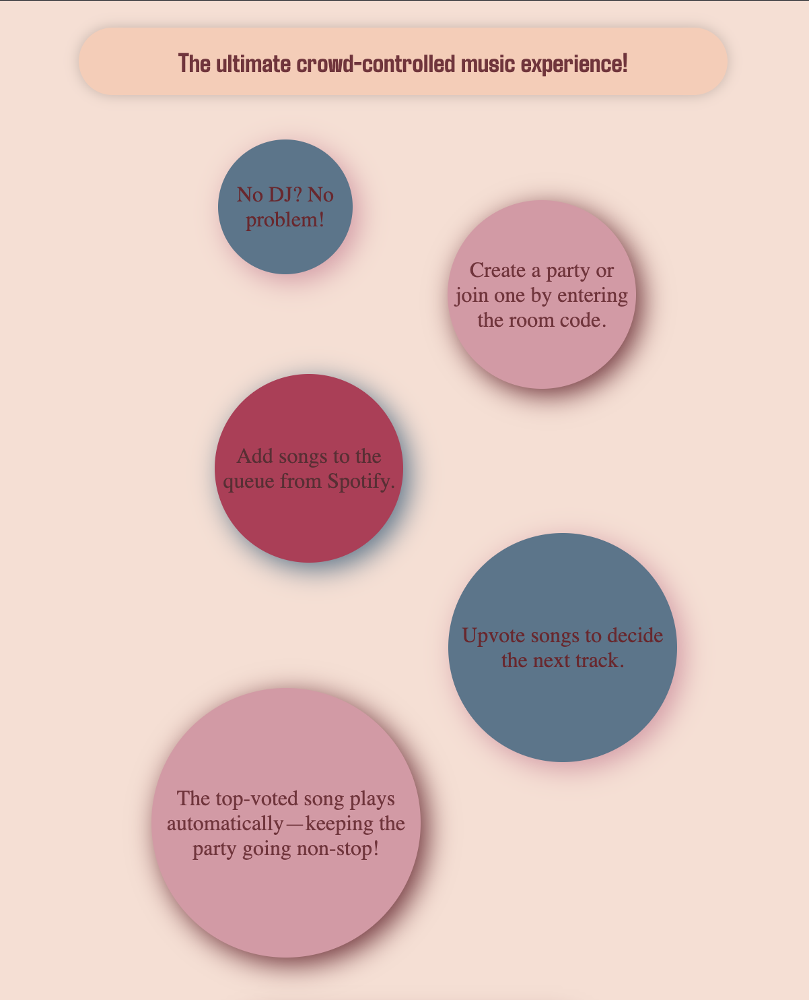

# VibeVote
VibeVote is a web application designed for creating and participating in live voting sessions, making it ideal for events, meetups, or casual gatherings where participants can cast their votes on various topics in real time. The platform allows users to create a new voting session with a customizable title and options, or join existing sessions using a unique code. With real-time updates powered by Socket.io, votes are counted and displayed instantly, and the results are visually represented using dynamic charts.  
  

